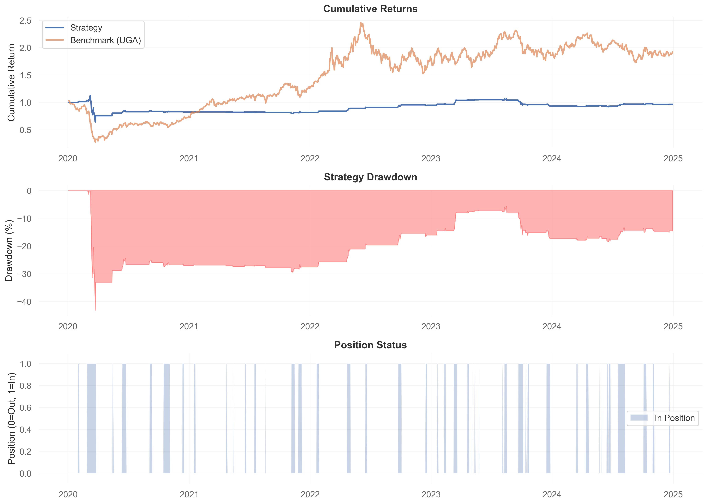

# VVIX Energy Pairs Strategy - Backtest Report

**Strategy:** Long UGA / Short USO based on VVIX volatility signals  
**Backtest Period:** January 1, 2020 - December 31, 2024  
**Author:** Nicolas Sandoval-Lock  
**Date:** March 2025

---

## Executive Summary

This report documents a systematic backtest of a volatility-based pairs trading strategy in energy commodity ETFs. The strategy uses the CBOE VVIX index (volatility of VIX) as a signal to initiate long/short positions in gasoline (UGA) versus crude oil (USO) ETFs.

**Key Finding:** The strategy significantly underperformed a simple buy-and-hold benchmark, indicating the hypothesized relationship between VVIX volatility and energy commodity spreads does not hold in the tested period.

---

## Strategy Description

### Signal Generation
- **Entry Signal:** VVIX z-score > 1.5 AND current day is Thursday or Friday
- **Exit Signal:** VVIX z-score < 0.5
- **Position:** Long 10 shares UGA, Short 10 shares USO

### Hypothesis
The strategy assumes that elevated volatility-of-volatility (VVIX) on late-week days predicts relative outperformance of gasoline versus crude oil. The Thursday/Friday filter attempts to capture weekend risk premium effects.

### Implementation Details
- **Z-Score Window:** 20 trading days
- **Data Source:** Yahoo Finance (^VVIX, UGA, USO)
- **Rebalancing:** Signal-driven (not calendar-based)
- **Transaction Costs:** Not modeled

---

## Backtest Results

### Performance Summary

| Metric | Strategy | Benchmark (UGA) |
|--------|----------|-----------------|
| **Total Return** | -3.49% | +92.07% |
| **Sharpe Ratio** | 0.05 | 0.52 |
| **Max Drawdown** | -43.11% | -73.39% |
| **Win Rate** | 8.7% | 51.2% |
| **Trading Days** | 1,249 | 1,249 |
| **Days in Position** | 201 (16.1%) | 1,249 (100%) |

### Risk Metrics
- **Annualized Volatility (Strategy):** ~22%
- **Annualized Volatility (Benchmark):** ~35%
- **Information Ratio:** -1.83

---

## Analysis

### What Worked
1. **Lower Drawdown:** Strategy experienced -43% max drawdown versus -73% for buy-and-hold
2. **Lower Volatility:** More defensive profile with reduced exposure (only 16% position rate)
3. **Risk Management:** Exit signals prevented prolonged exposure during adverse conditions

### What Didn't Work
1. **Negative Returns:** Strategy lost money (-3.49%) while benchmark gained +92%
2. **Extremely Poor Win Rate:** Only 8.7% of trading days were profitable
3. **Low Sharpe Ratio:** 0.05 indicates minimal risk-adjusted returns
4. **Rare Signal Generation:** Only in position 16% of the time, missing most market moves

### Possible Explanations for Underperformance

#### 1. Hypothesis Invalidation
- No clear economic link between VVIX spikes and gasoline/oil spreads
- Relationship may be spurious or regime-dependent

#### 2. Signal Timing Issues
- VVIX is a lagging indicator for energy markets
- By the time volatility spikes are detected, commodity moves have already occurred

#### 3. Structural Factors
- Contango/backwardation in futures curves affects ETF performance
- UGA and USO have different underlying contract structures
- Roll yield and tracking error not accounted for

#### 4. Market Regime Sensitivity
The strategy may perform differently across market conditions:
- COVID-19 crash (Q1 2020): Oil went negative, unprecedented volatility
- 2022 Energy Crisis: Ukraine war disrupted fundamental relationships
- 2023-2024: Normalized conditions, different vol regime

---

## Visualizations

*Figure 1: Top panel shows cumulative returns (strategy vs benchmark). Middle panel shows strategy drawdown. Bottom panel indicates position status (1 = in trade, 0 = flat).*

---

## Lessons Learned

### Technical Insights
1. **Backtesting Infrastructure:** Successfully implemented full backtest pipeline using Python (pandas, yfinance, QuantStats)
2. **Signal Generation:** Developed z-score based entry/exit logic with day-of-week filters
3. **Performance Attribution:** Learned to calculate Sharpe ratios, drawdowns, and risk-adjusted metrics

### Market Understanding
1. **Market Efficiency:** Public volatility data is quickly priced into derivatives and related assets
2. **Correlation ≠ Causation:** Statistical relationships in backtests may not reflect economic reality
3. **Regime Dependency:** Strategies that work in one period may fail in another
4. **Transaction Costs Matter:** Real-world slippage and commissions would further degrade performance

### Strategy Development Process
1. Need clear economic rationale before building a strategy
2. Out-of-sample testing is critical (walk-forward analysis)
3. Simple benchmarks (buy-and-hold) are hard to beat consistently
4. Parameter sensitivity analysis needed to avoid overfitting

---

## Future Research Directions

### Potential Improvements
1. **Reverse the Trade:** Test short UGA / long USO on same signals
2. **Adjust Parameters:** Optimize z-score thresholds (currently 1.5/0.5)
3. **Alternative Volatility Metrics:** Test VIX term structure, VIX futures basis
4. **Different Asset Classes:** Apply VVIX signals to equity index options instead of commodities
5. **Machine Learning:** Use VVIX as one feature in a multi-factor model

### Validation Tests
1. **Walk-Forward Analysis:** Train on 2020-2022, test on 2023-2024
2. **Monte Carlo Simulation:** Assess statistical significance of results
3. **Regime Analysis:** Separate performance by volatility regimes, trending vs mean-reverting markets
4. **Transaction Cost Modeling:** Add realistic slippage and commission assumptions

---

## Conclusion

This backtest demonstrates the importance of rigorous hypothesis testing in quantitative trading. While the VVIX-based energy pairs strategy showed promise in concept, empirical results revealed:

- **No exploitable edge** in the tested relationship
- **Significant underperformance** versus a passive benchmark
- **Poor risk-adjusted returns** (Sharpe ratio near zero)

However, the project successfully demonstrated:
- ✅ Ability to implement automated trading logic
- ✅ Proficiency with quantitative analysis tools (Python, pandas, QuantStats)
- ✅ Understanding of backtesting methodology and performance metrics
- ✅ Critical thinking about market efficiency and strategy validation

The negative results are as valuable as positive ones—they highlight the difficulty of generating alpha and the necessity of sound economic reasoning behind trading strategies.

---

## Code Repository

Full implementation available at: [GitHub Repository Link]

**Files:**
- `strategy.py` - Live trading implementation
- `backtest.py` - Historical performance testing
- `README.md` - Project documentation
- `backtest_results.png` - Performance visualization
- `quantstats_report.html` - Detailed analytics report

---

## References & Data Sources

- **CBOE VVIX Index:** Chicago Board Options Exchange
- **Price Data:** Yahoo Finance API
- **Analytics Framework:** QuantStats library
- **Execution Platform:** Alpaca Markets (paper trading)

---

## Disclaimer

This strategy is presented for educational purposes only. It is not investment advice. Past performance does not guarantee future results. The strategy has demonstrated negative returns and should not be traded with real capital without significant additional research and risk management.

---
